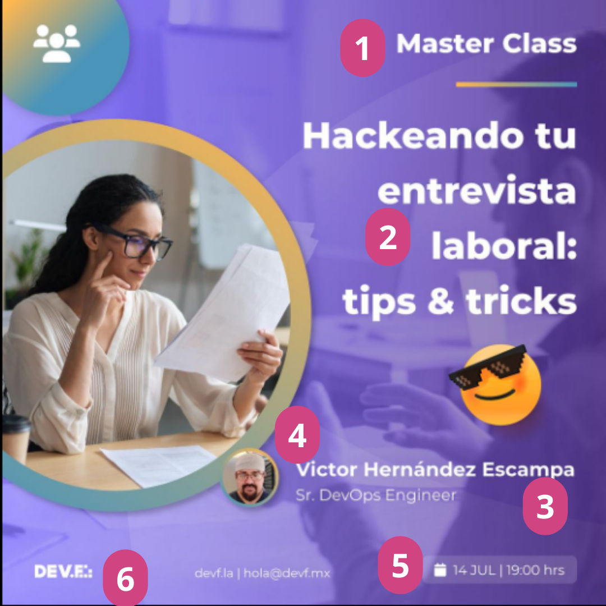

# El primer evento :eyes:

En algún momento, pasada la primera charla, tendrrás ganas de juntar a grandes personas de un campo en específico para que puedan impartir un workshop o una pequeña charla. Aquí algunos consejos de cómo hacerlo.

## Invitar Speakers
Esta es la parte más importante y tal vez por la quedeberías seguir.Y para realizar esto, te compartiré una fórmula que [Jonathan Castillo]() me compartió:

Saludo + Presentación personal y de la comunidad + invitación (¿Qué?) + descripción (¿por qué?) + call to action

Veamos qué implica cada parte.
### Saludo
Recuerda que buscas persuadir a la persona en cuestión para que acepte. Trata ser cordial y amable.
### Presentación personal y de la comunidad
Prséntate bajo las credenciales que te convengan más (Microsoft Learn Student Ambassador) o  de la comunidad a la que pertenezcas y con la que estés realizando tu evento.
### Invitación (¿Qué?)
Dile qué estás buscando con tu mensaje, llamada o con acercarte a hablar en persona... Aunque esta estrategía funciona mejor en mensaje por alguna red social  :see_no_evil:
### Descripción (¿por qué?)
Describe el evento para el que estás haciendo la invitación. El "por qué" viene con la temática del evento, es decir, si tu evento tratará sobre IA te deberás asegurar que la persona a la que invitas sea destacada en el área. Si es así, a la persona le quedará claro por qué le invitas.
Incluso podrías mencionarle de dónde la viste y qué fue lo que llevó a hacerle la invitación, ejemplo, estuviste en una charla anterior y te agradó la forma en que explicó el tema tan fácilmente. 
### Call to action
Finaliza con un *¿Qué te parece?*, *¿Le entras?*, *Quedo atenta*.
Así dejas la bolita en la persona para contestar. 

## Registro de asistencia
Un registro de asistencia te dará una buena idea sobre cuántas personas están interesadas en tu evento. Incluso, te podría servir para conocer si tal vez más mujeres están interesadas en el evento, conocer qué carrera cursan o sondear su nivel de conocimiento.

Para esto, puedo hablarte de dos opciones: Forms o algún sitio web de gestión de eventos como Eventbrite.

### Forms
La buena noticia, es que forms está incluido en el liceciamiento que obtienes desde que entras a MLSA. Y con este podrás realizar formularios fácilmente y rápido. Además podrías combinarlo con Power Automate para crear flujos de correos personalizados.

+ Empieza a usar [Forms](https://forms.office.com/)
+ Da un recorrido por [Power Automate](https://powerautomate.microsoft.com/es-mx/)

### Sitio web de gestión de eventos como Eventbrite

 + Revisa lo que tiene [Eventbritte](https://www.eventbrite.com.mx/signin/)
## Transmite tu evento

Con el fin de llegar a más personas, podría optar por hacer tu evento totalmente virtual o híbrido. Para eso, podrías continuar usando teams, zoom o cualquier otra plataforma que te permita alcanzar más personas. 
Sin embargo, aquí está otra opción: Streamyard.

StreamYard es una herramienta para hacer retransmisiones en directo y emitir en tus canales de redes sociales como FB, YT, Twitch, LinkedIn o una personalizada. Y es la mejor opción si: 

+ Tienen varias personas presentadoras en diferentes lugares. Puedes enviar un simple link de invitación.

+ Cuentas con recursos limitados en tu computadora. Streamyard funciona en el navegador web y no requieres instalar cosas extra ¡incluso puedes usar tu celular!

+ Cuentas con el GitHub Student Developer Pack. Este te da acceso al nivel Essencial totalmente gratis y con espacio para 10 personas invitadas.

### GitHub Student Developer Pack
Algunos requisitos para obtenerlo son:

- Estar actualmente inscrita en un curso de estudio que otorgue un título o diploma, como una escuela secundaria, escuela secundaria, colegio, universidad, educación en el hogar o institución educativa similar.
- Tener una dirección de correo electrónico verificable emitida por la escuela o cargue documentos que demuestren su estado actual de estudiante.
- Tener una cuenta de usuario de GitHub.
- Tener al menos 13 años de edad.

Y puedes obtenerlo [aquí](https://education.github.com/pack).

### Streamyard

+ Toma tus primeros pasos con [esta](https://support.streamyard.com/hc/es-419/sections/360008864072-Inicio-Preguntas-frecuentes) documentación.
+ Envía [este](https://support.streamyard.com/hc/es-419/articles/360043291612-Instrucciones-para-invitados) tutorial a tus invitados.

+ Accede a la documentación completa [aquí](https://support.streamyard.com/hc/es-419). 

## Crear el branding

El branding para un evento significa crear una identidad especial y única para ese evento. No se trata solo de un logotipo, sino de transmitir lo que hace que el evento sea especial y conectar con las personas emocionalmente.

El objetivo del branding es destacar el evento entre otros similares, transmitir sus valores y generar expectativas positivas. Para lograrlo, se utilizan herramientas digitales como redes sociales, correos electrónicos y aplicaciones móviles. 

El branding de un evento puede enfocarse en temas tecnológicos como inteligencia artificial, blockchain, ciberseguridad, big data o internet de las cosas. Estos temas reflejan la innovación y la modernidad del evento.

La paleta de colores y las ilustraciones son importantes en el branding de un evento. Los colores que elijamos transmiten emociones y crean una atmósfera específica. Las ilustraciones y gráficos personalizados ayudan a crear una imagen única para el evento y se utilizan en materiales promocionales como carteles y publicaciones en redes sociales. Es importante que los colores y las ilustraciones sean consistentes en todos los aspectos visuales del evento para que la gente los identifique fácilmente.

### Flyers de Speakers

Una de las partes más importantes del branding tal vez sean los flyers de speakers. Ya tienes una temática definida, una tecnología y hasta alguien importante en campo para hablar de esto. ¿Qué sigue? 
Darle difusión a través de redes sociales, grupos de whats o correo. Pra recopilar estos datos puedes optar por usar forms o herramientas más avanzadas como [sessionize](https://sessionize.com/).

Tomemos de ejemplo el trabajo de [DEV.F](https://www.instagram.com/p/CunW5fZv3Uc/)

1. Podemos encontrar el tipo de charla pero facilmente también podría ser sustituido por el nombre general del evento.
2. El nombre de la charla, generalmente lo define quien hablará. 
3. Agrega el nombre del speaker, mucho mejor si también puedes agregar sus títulos.
4. Tal vez su nombre no sea suficiente, agrega una foto del speaker también.
5. No olvides agregar la fecha y hora de la charla, mejor si agregas zonas horarias.
6. Y finalmente, pero no menos importante, agrega logos. Del evento, del programa e incluso, si lo hay, de patrocinadores. 

Si damos un zoom out a la publicación de ejemplo,  podrmos ver aún hay cosas que podemos agregar para difundir nuestro evento. Por ejemplo, en la caja de descripción podemos poner:
1. Un copywriting alineado a tu evento y específicamente a la charla en cuestión
2. Agrega un link de registro, trata de usar una versión corta, aunque también en el flyer podrías agregar un código QR. 
3. Para que otras personas fuera del círculo puedan dar con tu charla, podrías también agregar hashtags relacionados.

Aquí, algunas herramientas de diseño que podrían ayudarte:

+ [Canva](https://www.canva.com/es_mx/free/)

+ [Figma](https://www.figma.com/education/) (Está disponible una opción gratuita para estudiantes usando correo institucional)